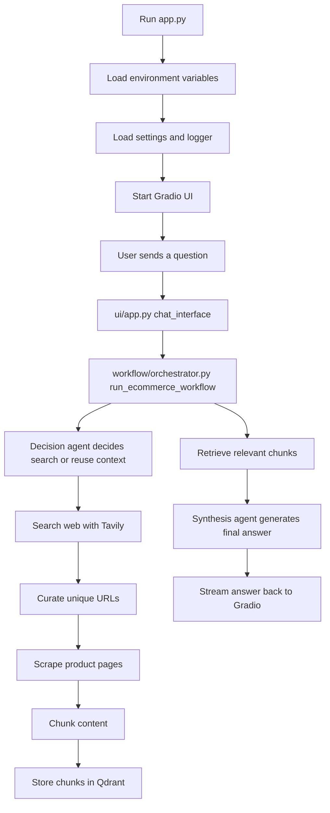
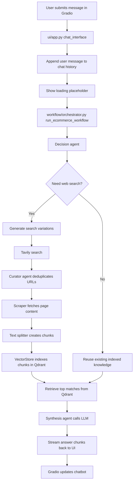
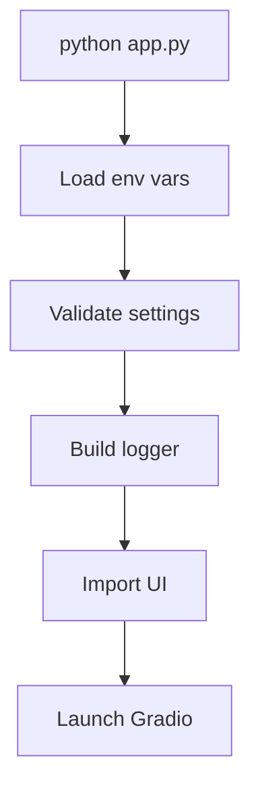
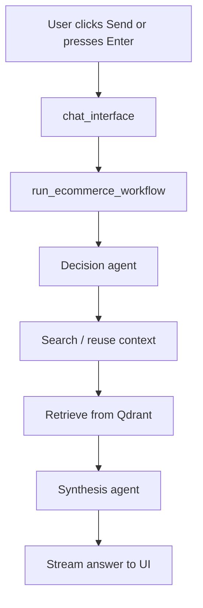

# E-commerce Chatbot RAG Guide

This project is a retrieval-augmented generation (RAG) chatbot for e-commerce questions.
It can search the web, scrape product pages, split content into chunks, store those chunks in a vector database, retrieve the most relevant passages, and then generate a final answer with an LLM.

This README is written as a beginner-friendly guide to help you understand:

1. What each file does.
2. How the app starts.
3. What happens when a user sends a message.
4. How data moves through the system from search to final answer.

## Big Picture

The app follows this high-level flow:



## How To Run

The main entry point is:

```bash
python app.py
```

That starts the Gradio interface defined in `ui/app.py`.

## Startup Call Chain

When you run `python app.py`, this is what happens:

```mermaid
flowchart TD
    A[python app.py] --> B[Load .env]
    B --> C[core/config.py creates settings]
    C --> D[core/logger.py creates logger]
    D --> E[Import ui/app.py demo object]
    E --> F[demo.launch() starts Gradio]
```

### Startup explained step by step

1. `app.py` loads environment variables from `.env`.
2. `core/config.py` validates required API keys and database settings.
3. `core/logger.py` prepares structured logging.
4. `ui/app.py` is imported, which builds the Gradio interface.
5. `demo.launch()` opens the chatbot UI in the browser.

## Chat Call Chain

When a user types a question and presses Send or Enter, the flow is:



## File-by-File Guide

### `app.py`

This is the program entry point.

What it does:

- Loads `.env` values.
- Suppresses some noisy torch warnings.
- Imports settings and logger early so missing configuration is caught quickly.
- Imports `demo` from `ui/app.py`.
- Launches the Gradio app with `demo.launch(share=False, show_error=True)`.

In simple terms, `app.py` is the "start the app" file.

### `ui/app.py`

This file builds the user interface.

What it does:

- Creates the Gradio chatbot layout.
- Stores a session ID and chat history.
- Defines `chat_interface`, the async handler that runs when a message is submitted.
- Calls `run_ecommerce_workflow` and streams each progress update to the chat window.

Important behavior:

- The assistant first shows a loading message.
- As the workflow progresses, the UI updates status, citations, and process logs.
- Both the Send button and pressing Enter trigger the same handler.

### `workflow/orchestrator.py`

This is the heart of the project.

It coordinates the full RAG pipeline and yields progress updates at each stage.

Main stages:

1. Decision agent decides whether the app needs a fresh web search.
2. If needed, the app generates search variations with the LLM.
3. The app searches the web using Tavily.
4. The curator agent removes duplicate URLs and normalizes results.
5. The scraper downloads and cleans page content.
6. The text splitter turns content into parent and child chunks.
7. The vector store indexes new chunks in Qdrant.
8. The app retrieves the most relevant chunks for the current question.
9. The synthesis agent streams the final answer from the LLM.

This file is the best place to start if you want to understand the full data flow.

### `agents/decision.py`

This agent decides whether the current question needs web search.

Behavior:

- If there is no useful chat history, it usually searches.
- If the question can be answered from previous conversation context, it may skip search.
- It uses the LLM router to make the decision.
- It is protected by a circuit breaker, so repeated failures do not keep hitting the API forever.

Output:

- A boolean flag: search or no search.
- A short reasoning string.

### `agents/curator.py`

This agent cleans the raw search results.

Behavior:

- Extracts the domain from each URL.
- Removes duplicate URLs.
- Normalizes the result shape so later steps can use it consistently.

Why it matters:

- Search engines can return repeated or noisy links.
- The curator keeps only the unique pages worth scraping.

### `agents/synthesis.py`

This agent generates the final answer.

Behavior:

- Builds a context block from retrieved chunks.
- Adds previous chat history when available.
- Sends a carefully designed prompt to the LLM.
- Streams the answer in pieces so the UI feels responsive.

Why it matters:

- This is the last step before the user sees the final response.
- It emphasizes using the most recent scraped data for prices and availability.

### `database/vector_store.py`

This file manages the vector database.

What it does:

- Connects to Qdrant Cloud using the configured URL and API key.
- Ensures the collection exists.
- Uses a SentenceTransformer embedding model to turn text into vectors.
- Adds chunks to Qdrant.
- Searches Qdrant for similar chunks.

Key idea:

- Each chunk is stored as a vector so semantic search can find relevant product information later.

### `tools/web_search.py`

This file performs web search using Tavily.

What it does:

- Rotates through available Tavily API keys.
- Uses a circuit breaker to stop repeated failing requests.
- Runs Tavily search in a background thread so the async workflow is not blocked.

Why it matters:

- The project needs fresh e-commerce data.
- This is the first source of current product links.

### `tools/scraper.py`

This file downloads and cleans page content.

What it does:

- Opens the URL with `aiohttp`.
- Uses a browser-like user agent.
- Removes scripts, styles, navigation, footer, and other noisy elements.
- Extracts readable text with BeautifulSoup.
- Truncates very long pages so the system stays manageable.

Why it matters:

- Search results are not enough by themselves.
- The scraper turns a page URL into usable text for indexing.

### `tools/text_splitter.py`

This file breaks scraped content into chunks.

What it does:

- Creates a parent chunk for broader context.
- Creates smaller child chunks for finer retrieval.
- Adds metadata like source URL, timestamps, and parent-child relationships.

Why it matters:

- Large product pages are hard to retrieve from as one block.
- Chunking makes semantic search more accurate.

### `core/config.py`

This file loads and validates configuration.

What it does:

- Reads values from `.env` and environment variables.
- Requires Qdrant and API keys to be present.
- Collects one or more Mistral API keys and Tavily API keys.
- Defines model names and retry settings.

Important environment variables:

- `QDRANT_URL`
- `QDRANT_API_KEY`
- `MISTRAL_API_KEY` or rotated keys like `MISTRAL_API_KEY_2`
- `TAVILY_API_KEY` or rotated keys like `TAVILY_API_KEY_2`

If these are missing, the app fails fast on startup.

### `core/llm.py`

This file sets up LLM access.

What it does:

- Builds a LiteLLM router with the configured Mistral deployments.
- Registers the small and large model names used elsewhere in the code.
- Sets timeout, retry, and cooldown behavior.
- Defines a small circuit breaker helper for the LLM pipeline.

Why it matters:

- The decision agent uses the small model.
- The synthesis agent uses the large model.

### `core/logger.py`

This file creates structured logging.

What it does:

- Adds timestamps, log level, session ID, file name, and line number to logs.
- Stores the session ID in a context variable so logs stay tied to one chat session.
- Exposes `set_session_id` and `clear_session_id` for workflow code.

Why it matters:

- This makes debugging much easier.
- When multiple users or sessions exist, logs stay separated by session.

### `requirements.txt`

This file lists the Python dependencies.

Major groups:

- Gradio for the UI.
- LiteLLM and LangChain packages for model access.
- Tavily for web search.
- BeautifulSoup and aiohttp for scraping.
- Qdrant client and SentenceTransformer for vector search.
- Pydantic settings for configuration.

## End-To-End Data Flow

Here is the simplest way to understand the project:

1. The user asks a question in the Gradio chatbot.
2. The UI sends the question to the orchestrator.
3. The decision agent decides whether fresh web search is needed.
4. If needed, the app searches the web and scrapes selected pages.
5. The scraped text is split into chunks.
6. The chunks are embedded and stored in Qdrant.
7. The app retrieves the most relevant chunks for the question.
8. The synthesis agent writes the answer using that retrieved context.
9. The answer streams back to the chat window.

## What Each Major Command Does

This project does not expose many terminal commands. The important ones are:

### Start the app

```bash
python app.py
```

Call chain:



### Submit a chat question

This is not a terminal command. It is a UI event.

Call chain:



## Beginner Notes

If you are new to this kind of project, keep these ideas in mind:

1. The UI does not answer questions directly. It only passes messages to the workflow.
2. The orchestrator is the main control center.
3. Search, scrape, chunk, store, retrieve, and answer are separate steps on purpose.
4. Qdrant is the long-term memory for scraped information.
5. The LLM is only one part of the system; the tools provide the actual evidence.

## External Services

This project depends on external services and APIs:

- Mistral for language model reasoning and generation.
- Tavily for web search.
- Qdrant Cloud for vector storage.

If any of those services fail, the code uses logging, retries, and circuit breakers to keep the app from crashing immediately.

## Suggested Reading Order For Beginners

If you want to learn the project in the fastest way, read the files in this order:

1. `app.py`
2. `ui/app.py`
3. `workflow/orchestrator.py`
4. `agents/decision.py`
5. `tools/web_search.py`
6. `tools/scraper.py`
7. `tools/text_splitter.py`
8. `database/vector_store.py`
9. `agents/synthesis.py`
10. `core/config.py`
11. `core/llm.py`
12. `core/logger.py`

That order follows the real runtime path from startup to answer generation.

## Summary

This chatbot is a multi-step e-commerce assistant built around a RAG pipeline.
`app.py` starts the app, `ui/app.py` handles the interface, and `workflow/orchestrator.py` coordinates the actual intelligence and data flow.

If you understand those three files first, the rest of the project becomes much easier to follow.
